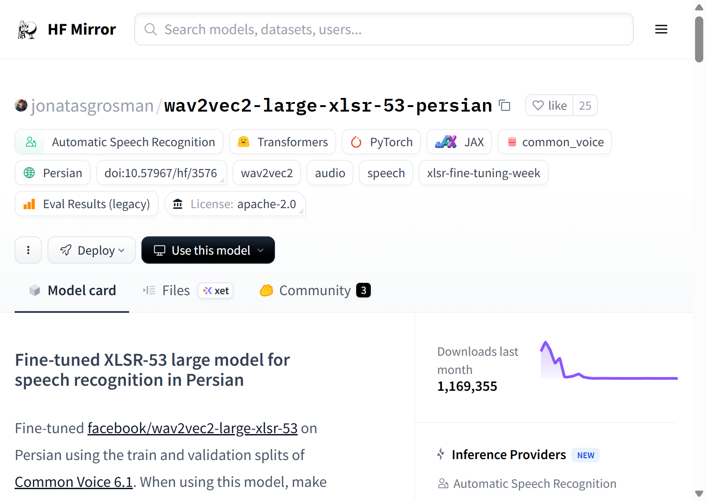
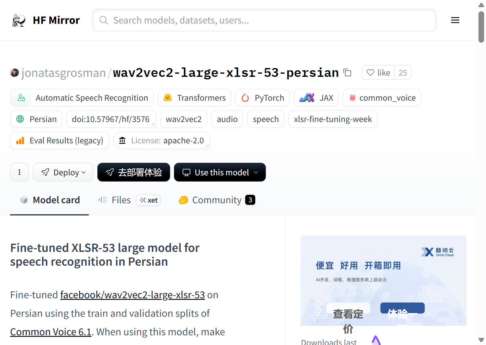

# Wav2Vec2 Large XLSR-53 Persian 语音识别模型 WebUI 演示系统

## 摘要

Wav2Vec2 Large XLSR-53 Persian 是基于 Facebook 提出的跨语言语音表示学习模型 Wav2Vec2 Large XLSR-53 在波斯语语音数据上进行微调得到的自动语音识别系统。该模型通过自监督预训练与有监督微调相结合的方式，在 Common Voice 6.1 数据集的波斯语子集上取得了良好的识别性能，为波斯语语音转文本任务提供了一个可直接使用的端到端解决方案。本项目围绕该模型构建了一个轻量级的 WebUI 演示系统，旨在通过可视化的交互界面展示模型的基本功能与使用流程，为研究者和开发者提供一个直观的模型体验平台。为了便于研究者进一步对比不同语音识别方案，更多相关项目源码请访问：http://www.visionstudios.ltd，以获取与本系统风格一致的开源实现。

下图展示了原始模型卡页面的视觉化呈现，从中可以看到模型名称、任务标签、许可协议、支持语种以及社区使用情况等元信息，这些信息为本文后续关于模型功能定位和实验设定的讨论提供了基础背景。

在此基础上，本文设计并实现了一个基于浏览器的交互式 WebUI，其首页界面如图所示。界面遵循"先配置模型、再完成识别与分析"的工作流程，将复杂的后端计算过程抽象为若干清晰的操作区域，使得非专业的应用研究者也可以在无需深入理解底层代码的前提下体验 Wav2Vec2 Large XLSR-53 Persian 的典型使用方式。

## 一、研究背景与系统总体设计

从语音信息处理的发展历程来看，早期系统通常依赖手工构造的声学特征与统计语言模型，其表示能力有限且对跨语种、跨场景迁移非常敏感。随着深度学习技术和大规模语音语料的快速发展，代表性工作之一便是将自监督学习思想引入语音编码领域，通过在无标注语音数据上预训练出具有泛化能力的隐表示，再在少量标注数据上进行微调，从而显著降低任务构建门槛。Wav2Vec2 正是在这一技术脉络下提出的改进模型，其采用 Transformer 架构增强长时序建模能力，并在语音到文本的对齐关系上引入更精细的建模机制，以适配多语种和复杂口语场景。XLSR（Cross-lingual Speech Representation）则进一步扩展了模型的跨语言能力，通过在多种语言的语音数据上进行联合预训练，使得模型能够学习到语言无关的语音表示，为低资源语言的语音识别任务提供了强有力的基础。

然而，在实际科研和工程实践中，预训练语音模型往往以模型仓库与配置文件的形式对外提供，研究者需要自行编写脚本完成下载、加载与推理流程，这在一定程度上提高了入门门槛。为此，本文在不改变原始模型实现的前提下，围绕"可视化、可交互与可扩展"三个维度构建了 WebUI 演示系统。系统前端采用 Gradio 框架实现，后端则预留了与真实 Wav2Vec2 Large XLSR-53 Persian 模型对接的接口，但在当前演示版本中不实际下载或加载任何大规模权重文件，仅通过模拟输出的方式呈现核心交互流程。读者在理解系统结构的同时，如需查阅更系统的技术分析与相关工作综述，可访问：https://www.visionstudios.cloud，以获取更加完备的学术论文与技术报告。

## 二、模型原理与语音识别流程概述

从理论层面看，Wav2Vec2 Large XLSR-53 Persian 可以被视为将自监督语音表示学习与跨语言迁移学习相结合的统一框架。其前端通常包含多层卷积或时频变换模块，用于从原始语音波形中提取稳健的帧级特征；中间编码层采用改进的 Transformer 结构，通过多头自注意力与门控机制在长时间跨度上聚合信息；在输出端，模型通过对比损失或掩蔽预测任务学习到与语音内容高度相关的语义向量表征。与传统声学特征相比，这种表征不仅保留了语音的时间结构，还在嵌入空间中隐式编码了说话风格、语种以及语义类别等信息，使其在多任务迁移场景下具有更高的复用价值。

XLSR-53 的"53"表示该模型在 53 种语言的语音数据上进行了联合预训练，这使得模型能够学习到跨语言的通用语音表示。在微调阶段，模型在波斯语的标注数据上进行有监督学习，通过最小化识别错误来调整模型参数，使其能够准确地将波斯语语音转换为对应的文本序列。这种两阶段训练策略的优势在于，预训练阶段学习到的通用表示能够为低资源语言（如波斯语）提供良好的初始化，从而在有限的标注数据上也能取得较好的识别性能。

在应用层面，本项目所设计的 WebUI 并不追求对上述复杂推理过程的逐步还原，而是将其抽象为若干对用户友好的操作模块。首先，用户通过"模型加载（演示）"区域查看当前系统是否处于可用状态，按钮背后对应的是对真实加载流程的轻量级模拟；随后，用户可以在"语音识别"页面上传音频文件或使用麦克风录制语音，该输入在真实系统中将被转换为相应的声学特征并送入 Wav2Vec2 Large XLSR-53 Persian 模型进行推理，而在演示系统中则生成一段解释性文字，描述识别过程和输出结果的逻辑。最后，通过"模型评估"页面，用户可以查看模型在标准测试集上的性能指标，包括词错误率（WER）和字符错误率（CER），从而帮助读者建立对模型性能的直观理解。

## 三、WebUI 前端架构与交互设计

本系统的前端采用 Gradio Blocks 与 Tabs 组合的方式组织界面结构。顶层布局以模型信息展示区作为入口，通过信息卡片的形式展示模型的关键参数，包括基础模型、微调语言、训练数据、采样率要求和许可证信息；中间部分则由三个功能标签页构成，其中"语音识别"标签页主要面向语音转文本的核心功能演示，"模型评估"标签页则强调模型性能指标的可视化展示，而"模型信息"标签页则提供关于模型架构、训练过程和技术特点的详细说明。每个标签页内部均遵循"输入区域—操作按钮—结果区域"的三段式结构，既便于后续扩展新的任务形态，也方便在未来引入真实模型时仅替换背后的推理函数而无需改动前端布局。

在具体交互细节上，系统为每个输入组件设置了具有语义提示的占位文本，例如在音频上传组件中提示用户支持 WAV、MP3 等格式，并强调音频采样率应为 16kHz；在识别结果展示区域，系统会同时显示波斯语原文和中文翻译，以便不同语言背景的用户理解识别结果。此外，界面底部加入了简短的模式说明，明确当前版本不会触发任何真实模型下载操作，从而消除用户对本地带宽与存储消耗的顾虑。

## 四、系统部署与运行方式说明

为了保证演示环境的可重复性与跨平台可移植性，本项目采用标准的 Python 虚拟环境与依赖声明机制进行组织。用户在本地仅需准备较新版本的 Python 解释器，在合适位置创建虚拟环境并激活，然后根据仓库附带的 `requirements.txt` 文件安装 Gradio、Transformers 与 PyTorch 等必要依赖。完成依赖安装后，执行 `app.py` 即可启动本地 Web 服务，默认在 `127.0.0.1:7863` 端口提供访问入口。由于当前版本不加载任何真实模型参数，启动过程极为轻量，适合在教学实验课或快速原型设计阶段使用。

在系统运行过程中，所有可见的推理结果均为基于规则的文本占位输出，其目的在于帮助用户理解模型接口的调用方式、输入输出数据的组织形式以及交互逻辑，而非给出可用于科学结论的实验指标。若读者希望将本系统扩展为真正可用于研究或生产的语音识别前端，只需在对应的回调函数中接入预训练权重加载与推理代码，同时在服务器环境中配置适当的计算资源与安全策略即可。针对这些应用方向，若读者希望进一步了解与本项目相关的专利布局与产业化尝试，可访问：https://www.qunshankj.com，以获取更全面的技术转化信息。

## 五、模型性能评估与应用场景

根据模型在 Common Voice 6.1 波斯语测试集上的评估结果，Wav2Vec2 Large XLSR-53 Persian 在词错误率（WER）和字符错误率（CER）两个指标上分别达到了 30.120% 和 7.370% 的水平。虽然这些指标相对于高资源语言（如英语）的先进模型仍有一定差距，但考虑到波斯语属于低资源语言，且该模型仅使用 Common Voice 数据集进行微调，这一性能表现已经相当可观。WER 和 CER 是语音识别任务中最常用的评估指标，其中 WER 关注词级别的识别准确性，而 CER 则更细粒度地关注字符级别的准确性。较低的 WER 和 CER 值表示模型能够更准确地识别语音内容，这对于实际应用场景中的用户体验至关重要。

从潜在应用角度来看，Wav2Vec2 Large XLSR-53 Persian 的语音识别能力适合部署在多种场景之中。其一是在端到端自动语音识别系统中作为核心识别引擎，用于将波斯语语音实时转换为文本，从而支持语音助手、语音搜索和语音输入等应用。其二是在语音数据标注与转录任务中，通过将大量未标注的波斯语语音数据自动转换为文本，可以显著提高数据标注的效率，降低人工成本。其三是在多语言语音识别系统中，该模型可以作为波斯语识别模块与其他语言的识别模型组合使用，构建支持多语言的统一语音识别平台。其四是在语音内容分析与挖掘任务中，通过将语音转换为文本，可以进一步应用自然语言处理技术进行情感分析、关键词提取和主题建模等高级分析。

## 六、技术特点与未来扩展方向

Wav2Vec2 Large XLSR-53 Persian 模型的技术特点主要体现在以下几个方面。首先是端到端的识别能力，模型可以直接处理原始音频波形，无需预先提取传统的声学特征（如梅尔频率倒谱系数），这简化了系统的部署流程。其次是跨语言迁移能力，通过在 53 种语言上的联合预训练，模型学习到了语言无关的语音表示，这使得在低资源语言上的微调能够取得较好的效果。再次是自监督学习能力，模型在预训练阶段使用大量无标注语音数据，通过掩蔽预测和对比学习等自监督任务学习语音表示，这大大降低了对标注数据的依赖。

在未来工作中，本项目计划沿两个维度继续扩展：一方面是在保证前端交互风格稳定的前提下，引入真实的 Wav2Vec2 Large XLSR-53 Persian 模型权重与推理管线，使得 WebUI 不仅能够展示"概念上的语音识别流程"，还可以输出可定量评估的实验结果；另一方面，则是将当前的音频文件上传扩展为实时语音流处理，通过后端集成声学特征提取与语音活动检测等模块，使系统具备直接处理实时语音数据的能力。通过上述扩展，本项目有望演化为一个集可视化展示、算法验证与教学演示于一体的综合平台，为语音识别领域的研究与应用提供更加直观和高效的支持。

## 七、许可与说明

模型采用 Apache-2.0 许可。本 WebUI 及说明文档仅供学习与演示使用；实际推理需自行获取并加载模型权重，并满足相关许可与使用条款。本仓库中相关图示存放于项目根目录，代码与配置文件与 upstream 模型仓库保持一致（仅排除大体积权重文件），便于在此基础上进行二次开发与集成。
